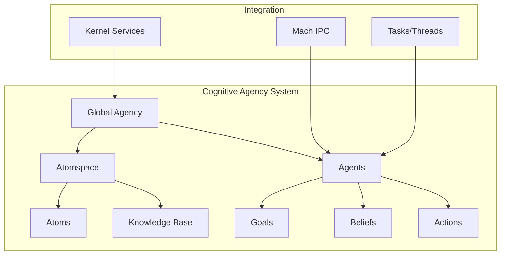

# Cognitive Agency in GNU Mach

## Overview

CognuMach implements an OpenCog-inspired cognitive agency layer that brings artificial general intelligence (AGI) concepts to the GNU Mach microkernel. This system enables autonomous agents with reasoning, learning, and goal-oriented behavior at the kernel level.

## Architecture

### Core Components



## Key Concepts

### 1. Atomspace

The **atomspace** is a distributed knowledge representation system inspired by OpenCog Hyperon. It stores knowledge as atoms - the basic units of information.

**Atom Types:**
- **Concept**: Abstract conceptual representations
- **Predicate**: Relations between concepts
- **Link**: Connections establishing relationships
- **Value**: Concrete data values
- **Goal**: Agent objectives
- **Belief**: Agent's knowledge state
- **Action**: Executable operations
- **Schema**: Behavioral patterns

**Truth Values:**
Each atom has a probabilistic truth value with:
- **Strength**: Degree of truth (0.0 - 1.0)
- **Confidence**: Certainty level (0.0 - 1.0)
- **Count**: Number of observations

### 2. Cognitive Agents

**Agents** are autonomous entities with:
- **Goals**: Objectives to achieve
- **Beliefs**: Current understanding of the world
- **Knowledge**: Personal knowledge base (atoms)
- **Reasoning**: Inference and planning capabilities
- **Actions**: Ability to affect the system
- **Communication**: IPC with other agents

**Agent States:**
- `IDLE`: Waiting for activation
- `REASONING`: Performing inference and planning
- `ACTING`: Executing planned actions
- `LEARNING`: Updating knowledge from experience
- `COMMUNICATING`: Exchanging messages
- `BLOCKED`: Waiting for resources

### 3. Cognitive IPC

Enhanced inter-process communication that extends Mach IPC with semantic understanding:

```c
/* Send semantic message between agents */
cognitive_agent_send_message(agent_from, agent_to, message_atom);

/* Receive and interpret messages */
cognitive_agent_receive_message(agent, &received_atom);
```

## API Reference

### Initialization

```c
/* Initialize the cognitive agency system */
void cognitive_agency_init(void);

/* Shutdown and cleanup */
void cognitive_agency_shutdown(void);
```

### Atomspace Operations

```c
/* Create a new atomspace */
cognitive_atomspace_t cognitive_atomspace_create(void);

/* Create an atom */
cognitive_atom_t cognitive_atom_create(
    cognitive_atomspace_t space,
    cognitive_atom_type_t type,
    const char *name);

/* Lookup atom by name */
cognitive_atom_t cognitive_atom_lookup(
    cognitive_atomspace_t space,
    const char *name);

/* Set truth value */
kern_return_t cognitive_atom_set_truth(
    cognitive_atom_t atom,
    float strength,
    float confidence);

/* Create link between atoms */
kern_return_t cognitive_atom_create_link(
    cognitive_atom_t from,
    cognitive_atom_t to,
    unsigned int link_type,
    float strength);

/* Remove link between atoms */
kern_return_t cognitive_atom_remove_link(
    cognitive_atom_t from,
    cognitive_atom_t to);

/* Count links for an atom */
unsigned int cognitive_atom_count_links(
    cognitive_atom_t atom);
```

### Agent Management

```c
/* Create a cognitive agent */
cognitive_agent_t cognitive_agent_create(
    const char *name,
    task_t task);

/* Destroy agent */
void cognitive_agent_destroy(cognitive_agent_t agent);

/* Add goal to agent */
kern_return_t cognitive_agent_add_goal(
    cognitive_agent_t agent,
    cognitive_atom_t goal);

/* Add belief to agent */
kern_return_t cognitive_agent_add_belief(
    cognitive_agent_t agent,
    cognitive_atom_t belief);
```

### Cognitive Operations

```c
/* Perform reasoning cycle */
kern_return_t cognitive_agent_reason(
    cognitive_agent_t agent);

/* Execute actions */
kern_return_t cognitive_agent_act(
    cognitive_agent_t agent);

/* Learn from experience */
kern_return_t cognitive_agent_learn(
    cognitive_agent_t agent,
    cognitive_atom_t experience);

/* Send message between agents */
kern_return_t cognitive_agent_send_message(
    cognitive_agent_t from,
    cognitive_agent_t to,
    cognitive_atom_t message);

/* Receive message */
kern_return_t cognitive_agent_receive_message(
    cognitive_agent_t agent,
    cognitive_atom_t *message);

/* Check pending messages */
unsigned int cognitive_agent_pending_messages(
    cognitive_agent_t agent);
```

### Query and Introspection

```c
/* Get system statistics */
unsigned int cognitive_agency_get_agent_count(void);
unsigned int cognitive_agency_get_atom_count(void);

/* Get agent state */
kern_return_t cognitive_agent_get_state(
    cognitive_agent_t agent,
    cognitive_agent_state_t *state);
```

## Usage Examples

### Example 1: Creating a Simple Agent

```c
#include <kern/cognitive_agency.h>

void create_simple_agent(void)
{
    cognitive_agent_t agent;
    cognitive_atom_t goal, belief;
    
    /* Create agent */
    agent = cognitive_agent_create("scheduler_optimizer", current_task());
    if (agent == COGNITIVE_AGENT_NULL) {
        printf("Failed to create agent\n");
        return;
    }
    
    /* Create a goal */
    goal = cognitive_atom_create(
        global_cognitive_agency.atomspace,
        ATOM_TYPE_GOAL,
        "minimize_context_switches");
    cognitive_atom_set_truth(goal, 1.0f, 0.8f);
    
    /* Add goal to agent */
    cognitive_agent_add_goal(agent, goal);
    
    /* Create a belief */
    belief = cognitive_atom_create(
        global_cognitive_agency.atomspace,
        ATOM_TYPE_BELIEF,
        "cpu_load_high");
    cognitive_atom_set_truth(belief, 0.9f, 0.7f);
    
    /* Add belief to agent */
    cognitive_agent_add_belief(agent, belief);
    
    /* Perform reasoning */
    cognitive_agent_reason(agent);
    
    /* Execute actions based on reasoning */
    cognitive_agent_act(agent);
}
```

### Example 2: Agent Communication

```c
void demonstrate_agent_communication(void)
{
    cognitive_agent_t monitor, optimizer;
    cognitive_atom_t message;
    
    /* Create two agents */
    monitor = cognitive_agent_create("system_monitor", current_task());
    optimizer = cognitive_agent_create("performance_optimizer", current_task());
    
    /* Create message atom */
    message = cognitive_atom_create(
        global_cognitive_agency.atomspace,
        ATOM_TYPE_VALUE,
        "high_memory_pressure");
    cognitive_atom_set_truth(message, 0.95f, 0.9f);
    
    /* Send message from monitor to optimizer */
    cognitive_agent_send_message(monitor, optimizer, message);
    
    /* Optimizer can now reason about the message */
    cognitive_agent_reason(optimizer);
}
```

### Example 3: Knowledge Representation with Links

```c
void build_knowledge_base(void)
{
    cognitive_atomspace_t space = global_cognitive_agency.atomspace;
    cognitive_atom_t concept1, concept2;
    
    /* Create concepts */
    concept1 = cognitive_atom_create(space, ATOM_TYPE_CONCEPT, "memory");
    concept2 = cognitive_atom_create(space, ATOM_TYPE_CONCEPT, "performance");
    
    /* Create relationship link between atoms */
    cognitive_atom_create_link(concept1, concept2, 1 /* AFFECTS */, 0.85f);
    
    /* Set truth values */
    cognitive_atom_set_truth(concept1, 0.9f, 0.8f);
    cognitive_atom_set_truth(concept2, 0.8f, 0.7f);
    
    /* Query link count */
    unsigned int links = cognitive_atom_count_links(concept1);
    printf("Concept 'memory' has %u links\n", links);
}
```

### Example 4: Agent Learning

```c
void demonstrate_agent_learning(void)
{
    cognitive_agent_t agent;
    cognitive_atom_t experience;
    
    /* Create learning agent */
    agent = cognitive_agent_create("adaptive_scheduler", current_task());
    
    /* Create experience atom */
    experience = cognitive_atom_create(
        global_cognitive_agency.atomspace,
        ATOM_TYPE_VALUE,
        "reduced_context_switches");
    cognitive_atom_set_truth(experience, 0.8f, 0.5f);
    
    /* Agent learns from experience */
    cognitive_agent_learn(agent, experience);
    
    /* Truth value confidence increased through learning */
    printf("Experience confidence: %.2f\n", experience->truth.confidence);
}
```

### Example 5: Message Queue and Communication

```c
void demonstrate_message_queue(void)
{
    cognitive_agent_t sender, receiver;
    cognitive_atom_t msg1, msg2, received;
    
    /* Create agents */
    sender = cognitive_agent_create("monitor", current_task());
    receiver = cognitive_agent_create("optimizer", current_task());
    
    /* Create messages */
    msg1 = cognitive_atom_create(
        global_cognitive_agency.atomspace,
        ATOM_TYPE_VALUE,
        "high_cpu_load");
    msg2 = cognitive_atom_create(
        global_cognitive_agency.atomspace,
        ATOM_TYPE_VALUE,
        "memory_pressure");
    
    /* Send messages */
    cognitive_agent_send_message(sender, receiver, msg1);
    cognitive_agent_send_message(sender, receiver, msg2);
    
    /* Check message queue */
    unsigned int pending = cognitive_agent_pending_messages(receiver);
    printf("Receiver has %u pending messages\n", pending);
    
    /* Receive messages */
    while (cognitive_agent_pending_messages(receiver) > 0) {
        cognitive_agent_receive_message(receiver, &received);
        printf("Received message: %s\n", received->name);
        
        /* Process message through reasoning */
        cognitive_agent_reason(receiver);
    }
}
```

## Integration with Mach

### IPC Integration

Cognitive agents integrate with Mach's IPC system through control and message ports:

```c
agent->control_port  /* Port for controlling the agent */
agent->message_port  /* Port for semantic messages */
```

### Task/Thread Binding

Agents can be bound to Mach tasks and threads:

```c
agent->task    /* Associated Mach task */
agent->thread  /* Associated Mach thread */
```

## Performance Considerations

### Memory Usage

- Each atom: ~128 bytes
- Each agent: ~256 bytes + knowledge base
- Global atomspace: Limited to 10,000 atoms by default

### Locking Strategy

The system uses fine-grained locking:
- Global agency lock: Protects agent list
- Atomspace lock: Protects atom collection
- Agent lock: Protects agent state
- Atom lock: Protects individual atom data

### Scalability

The current implementation is designed for:
- Up to 100 concurrent agents
- Up to 10,000 atoms in the atomspace
- Moderate reasoning complexity

## Future Enhancements

### Planned Features

1. **Advanced Reasoning**
   - Pattern matching engine
   - Inference rules (forward/backward chaining)
   - Planning algorithms (STRIPS, HTN)
   - Probabilistic reasoning (Bayesian networks)

2. **Learning Mechanisms**
   - Reinforcement learning for agent behavior
   - Hebbian learning for atom associations
   - Experience replay and knowledge consolidation
   - Adaptive truth value updates

3. **Distributed Atomspace**
   - Distributed knowledge sharing between agents
   - Consistency protocols (eventual consistency)
   - Replication and caching strategies

4. **Enhanced IPC**
   - Semantic message routing
   - Content-based addressing
   - Publish-subscribe patterns for agent communication
   - Message priority based on importance

5. **Formal Verification**
   - Correctness proofs for critical reasoning paths
   - Security analysis of agent interactions
   - Deadlock detection in multi-agent systems

6. **Monitoring and Debugging**
   - Agent activity tracing
   - Knowledge base visualization
   - Reasoning path inspection
   - Performance profiling

## Design Philosophy

The cognitive agency system follows these principles:

1. **Minimal Overhead**: Lightweight implementation suitable for kernel-level operation
2. **Safety First**: Careful resource management and bounds checking
3. **Extensibility**: Modular design allowing future enhancements
4. **Integration**: Seamless integration with existing Mach mechanisms
5. **Inspiration**: Based on proven AGI research (OpenCog Hyperon)

## References

1. Goertzel, B., et al. "OpenCog Hyperon: A Framework for AGI at the Human Level and Beyond" (2023)
2. Liedtke, J. "On Micro-Kernel Construction" (1995)
3. Tanenbaum, A. "Modern Operating Systems" (2014)
4. Russell, S. & Norvig, P. "Artificial Intelligence: A Modern Approach" (2020)

## Contributing

To contribute to the cognitive agency system:

1. Understand the atomspace model
2. Follow the existing code style
3. Add tests for new reasoning capabilities
4. Document new agent behaviors
5. Consider performance implications

## See Also

- [IPC Documentation](ipc.md)
- [Task and Thread Management](threads-and-tasks.md)
- [Mach 5 Research](mach5-research.md)
- [Architecture Overview](architecture-overview.md)
